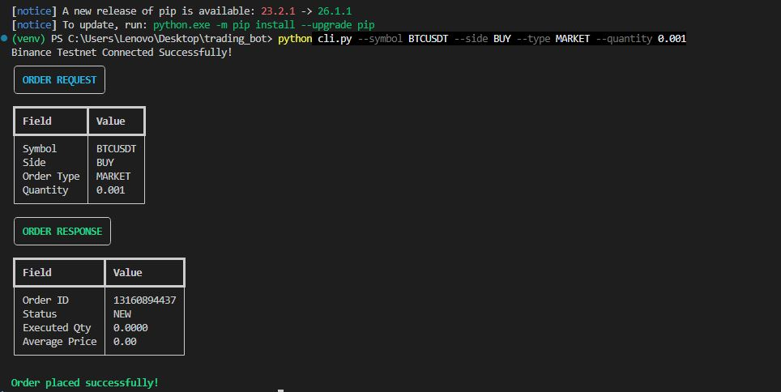
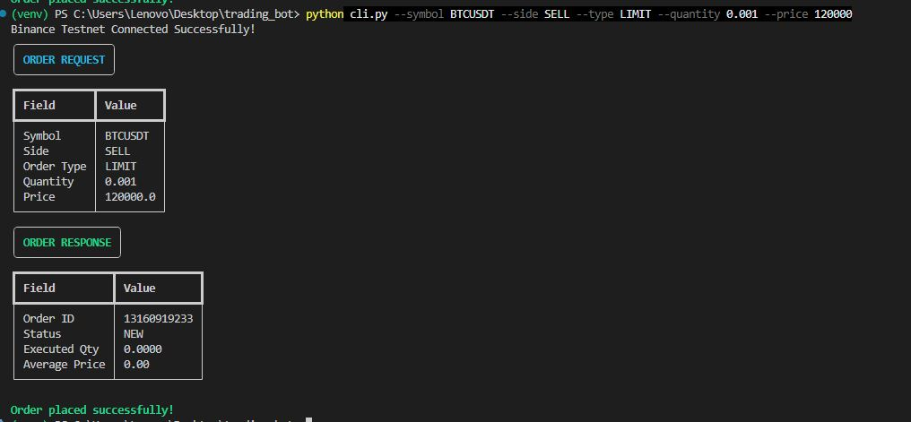
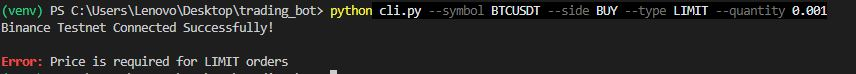

# Binance Futures Testnet Trading Bot

## Features
- MARKET orders
- LIMIT orders
- BUY/SELL support
- CLI arguments
- Logging
- Error handling

## Setup

pip install -r requirements.txt

## Configure API Keys

Create .env file:

API_KEY=your_key
API_SECRET=your_secret

## Run MARKET Order

python cli.py --symbol BTCUSDT --side BUY --type MARKET --quantity 0.001

## Run LIMIT Order

python cli.py --symbol BTCUSDT --side SELL --type LIMIT --quantity 0.001 --price 120000
## Bonus Feature

Enhanced CLI UX using the Rich library:
- Colored terminal output
- Structured request/response tables
- Improved validation messages
- Better readability
## Output Screenshots

### MARKET Order

### LIMIT Order

### Validation Error

### Missing Price Error
